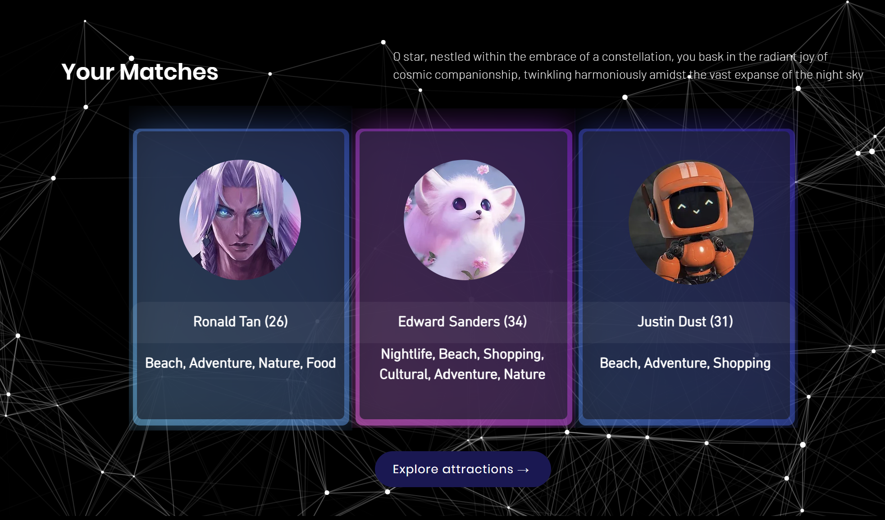
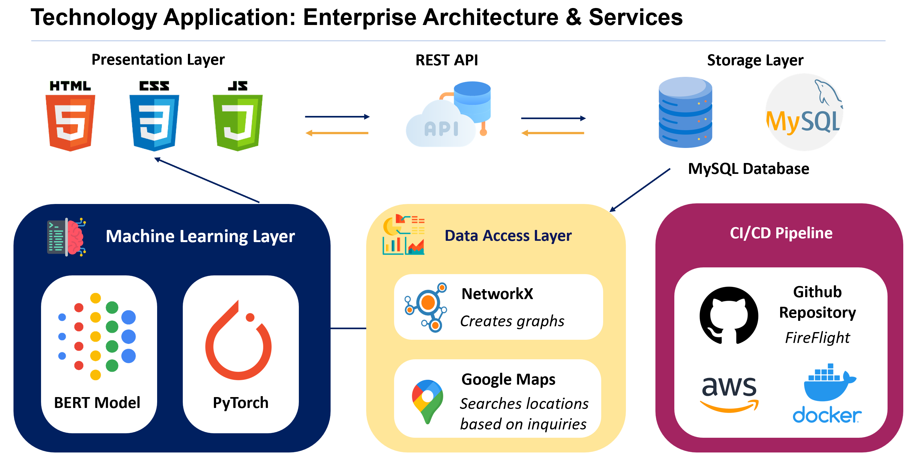

    

  <b>FireFlight</b>

  <i>Your Travel Companion for Sparking Connections</i>

&nbsp;

<h1 align="center">📖 A Guide to FireFlight </h1>

 <b> FireFlight </b>  is an application that aspires to bring a fresh perspective to the travel and aviation industry. Our platform is designed to connect like-minded travelers, fostering a community that shares a passion for exploration and adventure. With Fireflight, users can find their perfect travel companion, making their journey more enjoyable and memorable. Click here to visit our website! </a> 

&nbsp;

<h1>⚙️ Technology Stack </h1>

  <kbd>
      
  </kbd>
  <kbd>
      
  </kbd>
  <kbd>
      
  </kbd>
  <kbd>
      
  </kbd>
  <kbd>
      
  </kbd>
  <kbd>
      
  </kbd>
  <kbd>
      
  </kbd>
    
  <b> MySQL | PyTorch | Google Maps | NetworkX | BERT | Docker | AWS </b>

&nbsp;

<h1>📽️ Demo Video </h1>

&nbsp;

<h1>🔨 Core Functionalities </h1>

<b>1. User Profiles</b>

Users can create personalized profiles, including a self-made bio to introduce themselves. Our matchmaking algorithm will subsequently compare this bio to other users' bios to find the most compatible travel companions for our users. Users may also indicate their own personal interests, such that they may be matched with other users based on common interests.

<b>2. Matchmaking Algorithm</b>

Fireflight uses a sophisticated matchmaking algorithm that takes into account user preferences, shared interests, and other factors to suggest potential matches. The algorithm leverages machine learning and natural language processing to provide highly customised match suggestions.

<b>3. Shared Travel Platform</b>

Our application acts as not only one that connects like-minded travelers together but also a one-stop platform where travelers can even make future plans for their trips. Once potential matches are formed, users can connect to each other within the app and a recommendation engine will recommend a series of attractions to the matched users. The attractions will be recommended based on their proximity from each of their hotels and shared interests.

<b>3. Chat Platform with Real-Time Translation & Travel Chatbot </b>

Our chat platform allows matched users to communicate with each other prior to the trip. It also has built-in real-time translation to connect users from different countries speaking different languages. For quick travel inqueries, users may also use our travel chatbot powered by ChatGPT. 

<h1> Our Enterprise Architecture </h1>

<b>1. Presentation Layer </b>

The presentation layer refers to the user interface of the application, including the website that travelers interact with. It aims to provide a seamless and user-friendly experience for solo travelers to connect with potential companions. We have also infused a storyline with engaging and interactive animations to enhance the customer journey. 

<b>2. Storage Layer </b>

The storage layer in FireFlight encompasses the MySQL database used to store user profiles, preferences, and other relevant data. It ensures secure and efficient storage and retrieval of information to support the application's functionalities.

<b>3. Data Access Layer </b>

The data access layer in FireFlight manages the interaction between the application and the underlying data sources. It includes components like APIs, database connectors, and data access patterns that allow the application to retrieve and update user data from storage. We mainly use NetworkX to add users to a graph and calculate correlations in interests from there. In processing map data, we used the Google Maps API to find the closest relevant attractions for the user to visit. 

<b>4. Machine Learning Layer</b>

The ML layer in FireFlight incorporates a thorough machine learning algorithm and model created with the aid of PyTorch to enhance the matching and recommendation capabilities of the application. It leverages user preferences, interests, and other relevant data to provide personalized suggestions for travel companions. Furthermore, we also utilised the BERT model to analyse compatabitility through user sentiments and speech patterns in their bios and thereby match them with other users. The combined effect of both the ML algorithm & model as well as the BERT model allow us to calculate a compatibility score between a pair of users, a score deeply enhanced by analysing user data. 

<b>5. CI/CD Pipeline</b>

The CI/CD pipeline implemented for your project utilizes the integration between GitHub, AWS EC2, and Docker to enable a streamlined software delivery process. It involves code development and version control on GitHub, automated builds and tests through CI, containerization with Docker, and deployment to AWS EC2 instances. The pipeline ensures continuous delivery of reliable and scalable applications, empowering efficient development and deployment workflows.

<h1> Our User Flow Chart </h1>

<h1> The Team </h1>
<table>
  <tr>
    <th></th>
    <th></th>
    <th></th>
    <th></th>
  </tr>
  <tr>
    <td align="center"><h3><b><a href="https://github.com/howllian27">Howell Chan</a></b></h3>
<i>Nanyang Technological University</i>
</td>
    <td align="center"><h3><b><a href="https://github.com/XeuniceX">Eunice Lee</a></b></h3>
<i>Nanyang Technological University</i>
</td>
    <td align="center"><h3><b><a href="https://github.com/chenglin2003">Cheng Lin</a></b></h3>
<i>Nanyang Technological University</i>
</td>
    <td align="center"><h3><b><a href="https://github.com/tayweihong">Tay Wei Hong</a></b></h3>
<i>Nanyang Technological University</i>
</td>
  </tr>
  <tr>
    <td align="center"><h3><b>
Backend Developer
</b></h3></td>
    <td align="center"><h3><b>
Frontend Developer
</b></h3></td>
    <td align="center"><h3><b>
UI/UX Designer
</b></h3></td>
    <td align="center"><h3><b>
Web API Developer
</b></h3></td>
  </tr>
</table>
